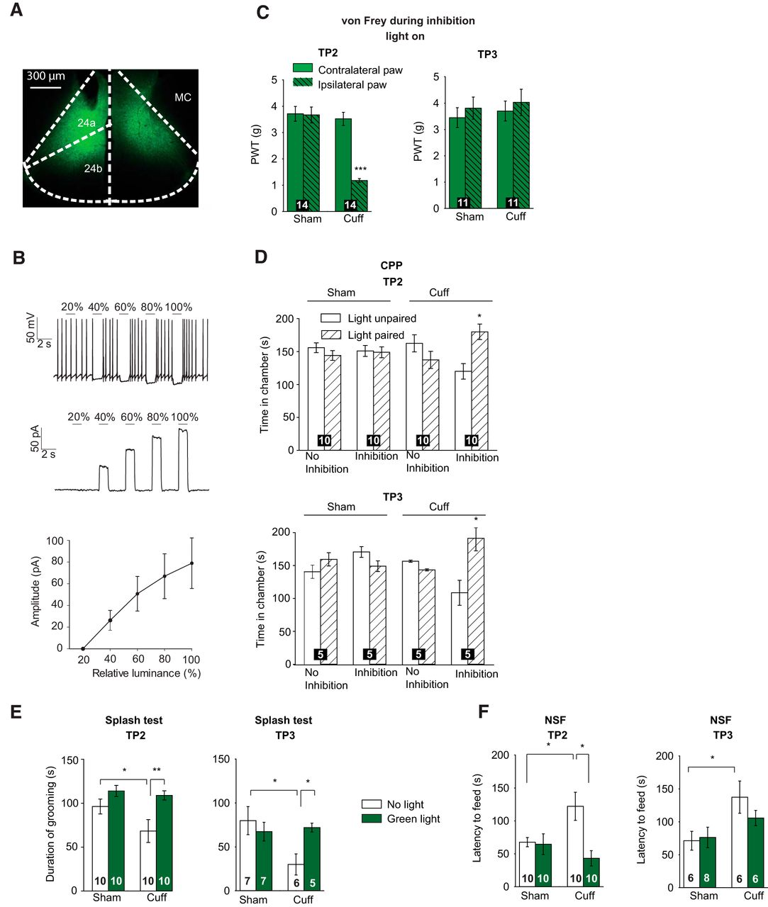

<!-- Main -->

<!-- Two -->
<section id="two" class="spotlights">
	<section>
		
		

			

				<header class="major">
					<h3>Hyperactivity of Anterior Cingulate Cortex Areas 24a/24b Drives Chronic Pain-Induced Anxiodepressive-like Consequences.</h3>
				</header>
				
Pain associates both sensory and emotional aversive components, and often leads to anxiety and depression when it becomes chronic. Here, we characterized, in a mouse model, the long-term development of these sensory and aversive components as well as anxiodepressive-like consequences of neuropathic pain and determined their electrophysiological impact on the anterior cingulate cortex (ACC, cortical areas 24a/24b). We show that these symptoms of neuropathic pain evolve and recover in different time courses following nerve injury in male mice. In vivo electrophysiological recordings evidence an increased firing rate and bursting activity within the ACC when anxiodepressive-like consequences developed, and this hyperactivity persists beyond the period of mechanical hypersensitivity. Whole-cell patch-clamp recordings also support ACC hyperactivity, as shown by increased excitatory postsynaptic transmission and contribution of NMDA receptors. Optogenetic inhibition of the ACC hyperactivity was sufficient to alleviate the aversive and anxiodepressive-like consequences of neuropathic pain, indicating that these consequences are underpinned by ACC hyperactivity. Chronic pain is frequently comorbid with mood disorders, such as anxiety and depression. It has been shown that it is possible to model this comorbidity in animal models by taking into consideration the time factor. In this study, we aimed at determining the dynamic of different components and consequences of chronic pain, and correlated them with electrophysiological alterations. By combining electrophysiological, optogenetic, and behavioral analyses in a mouse model of neuropathic pain, we show that the mechanical hypersensitivity, ongoing pain, anxiodepressive consequences, and their recoveries do not necessarily exhibit temporal synchrony during chronic pain processing, and that the hyperactivity of the anterior cingulate cortex is essential for driving the emotional impact of neuropathic pain.

				<ul class="actions">
					<li><a href="https://www.jneurosci.org/content/38/12/3102" class="button">Learn more</a></li>
				</ul>
			

		

	</section>
	<section>
		
		

			

				<header class="major">
					<h3>The anterior cingulate cortex is a critical hub for pain-induced depression.</h3>
				</header>
				
Besides chronic stress, chronic pain is a prevalent determinant for depression. Changes induced in specific brain regions by sustained pain may alter the processing of affective information, thus resulting in anxiodepressive disorders. Here, we compared the role of the anterior cingulate cortex (ACC) and the posterior insular cortex in the anxiodepressive, sensory, and affective aspects of chronic pain.Neuropathic pain was induced by cuffing the right sciatic nerve of C57BL/6J mice. Lesions were performed by local injection of ibotenic acid and chronic activation of the ACC by optogenetic stimulation. Anxiodepressive-related behaviors were evaluated through the novelty suppressed feeding, marble burying, splash, and forced swimming tests. Mechanical thresholds were determined using von Frey filaments, and the relief of spontaneous pain was determined by using place conditioning. The ACC lesion prevented the anxiodepressive consequences of chronic pain without affecting the sensory mechanical allodynia. Conversely, the tonic or spontaneous pain and the anxiodepressive consequences of pain remained present after posterior insular cortex lesion, even though the mechanical allodynia was suppressed. Furthermore, optogenetic stimulation of the ACC was sufficient to induce anxiety and depressive-like behaviors in naïve animals. Our results show that, at cortical level, the sensory component of chronic pain remains functionally segregated from its affective and anxiodepressive components. Spontaneous tonic pain and evoked allodynia can be experimentally dissociated. Furthermore, the ACC appears as a critical hub for mood disorders, including for the anxiodepressive consequences of chronic pain, and thus constitutes an important target for divulging the underlying mechanism.
				

				<ul class="actions">
					<li><a href="https://linkinghub.elsevier.com/retrieve/pii/S0006-3223(14)00597-6" class="button">Learn more</a></li>
				</ul>
			

		

	</section>
	<section>
		
		

			

				<header class="major">
					<h3>Give me a sign: decoding complex coordinated hand movements using high-field fMRI.</h3>
				</header>
				
Decoding movements from the human cortex has been a topic of great interest for controlling an artificial limb in non-human primates and severely paralyzed people. Here we investigate feasibility of decoding gestures from the sensorimotor cortex in humans, using 7 T fMRI. Twelve healthy volunteers performed four hand gestures from the American Sign Language Alphabet. These gestures were performed in a rapid event related design used to establish the classifier and a slow event-related design, used to test the classifier. Single trial patterns were classified using a pattern-correlation classifier. The four hand gestures could be classified with an average accuracy of 63 % (range 35–95 %), which was significantly above chance (25 %). The hand region was, as expected, the most active region, and the optimal volume for classification was on average about 200 voxels, although this varied considerably across individuals. Importantly, classification accuracy correlated significantly with consistency of gesture execution. The results of our study demonstrate that decoding gestures from the hand region of the sensorimotor cortex using 7 T fMRI can reach very high accuracy, provided that gestures are executed in a consistent manner. Our results further indicate that the neuronal representation of hand gestures is robust and highly reproducible. Given that the most active foci were located in the hand region, and that 7 T fMRI has been shown to agree with electrocorticography, our results suggest that this confined region could serve to decode sign language gestures for intracranial brain–computer interfacing using surface grids.

				<ul class="actions">
					<li><a href="https://link.springer.com/article/10.1007%2Fs10548-013-0322-x" class="button">Learn more</a></li>
				</ul>
			

		

	</section>
	<section>
		
		

			

				<header class="major">
					<h3>Transient expression of functional serotonin 5-HT3 receptors by glutamatergic granule cells in the early postnatal mouse cerebellum.</h3>
				</header>
				
The serotonin 5-HT(3) receptor is the only ligand-gated ion channel activated by serotonin and is expressed by GABAergic interneurons in many brain regions, including the cortex, amygdala and hippocampus. Furthermore, 5-HT(3) receptors are expressed by glutamatergic Cajal-Retzius cells in the cerebral cortex. We used 5-HT(3A)/enhanced green fluorescent protein (EGFP) transgenic mice to show that 5-HT(3) receptors are also ubiquitously expressed by glutamatergic granule cells in the cerebellum during the first three postnatal weeks. Using whole-cell patch clamp recordings, we show that local application of either serotonin or the selective 5-HT(3) receptor agonist SR57227A to granule cells results in a small inward current, demonstrating a post- and/or extrasynaptic localisation of the 5-HT(3) receptors. Functional 5-HT(3) receptors were also observed presynaptically at the parallel fibre-Purkinje cell synapse. Pharmacological block using the selective 5-HT(3) receptor antagonist tropisetron induced a reduction in the frequency of miniature synaptic events recorded from Purkinje cells. Paired-pulse stimulation of parallel fibres on whole-cell voltage clamped Purkinje cells from 1-week-old mice did not yet show synaptic plasticity. In the presence of tropisetron, the parallel fibre-Purkinje cell synapse showed paired-pulse depression. Taken together, these results show that functional 5-HT(3) receptors are present during early postnatal development in the cerebellum, where they modulate synaptic plasticity.

				<ul class="actions">
					<li><a href="https://www.ncbi.nlm.nih.gov/pubmed/21878518" class="button">Learn more</a></li>
				</ul>
			

		

	</section>
</section>

